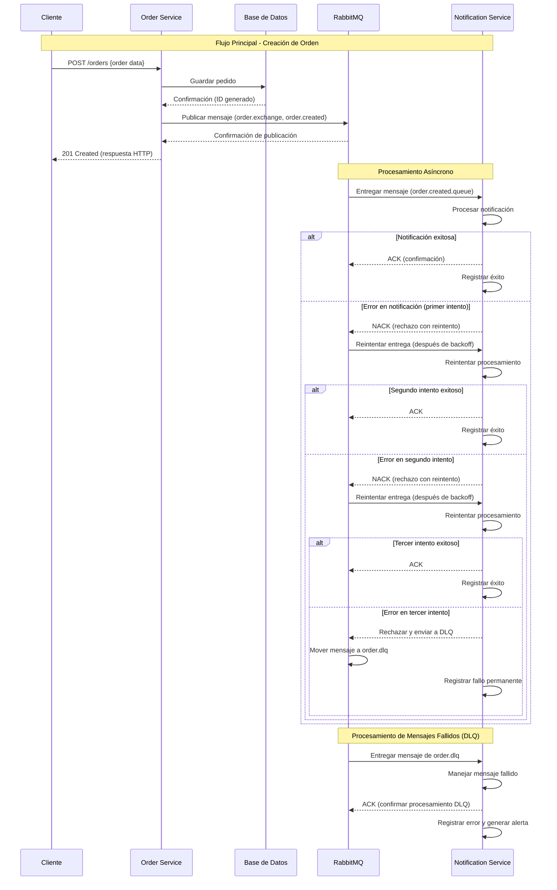

# microservices-rabbitmq
Repositorio de práctica para aprender mensajería con RabbitMQ usando una arquitectura de microservicios. Contiene dos microservicios: uno que envía (producer) y otro que recibe/activa acciones cuando llegan mensajes desde RabbitMQ (consumer). Ideal para practicar patrones de integración, colas, exchanges y pruebas locales con Docker.

